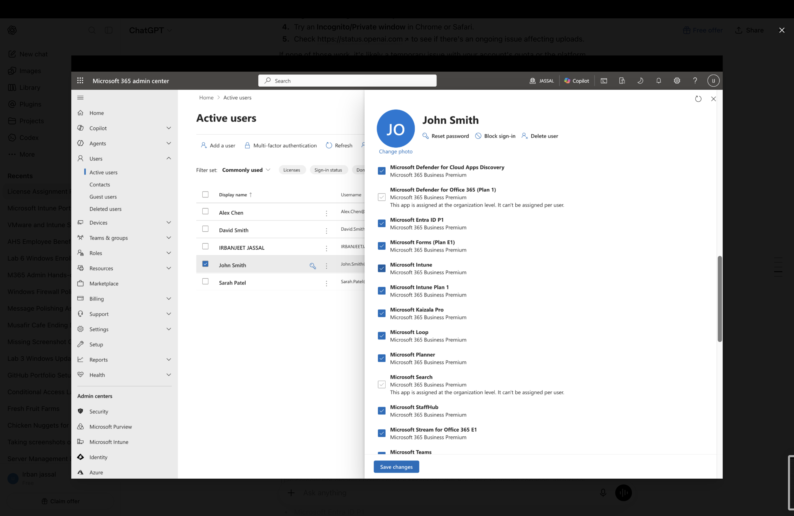

```markdown
# Lab 1 – Microsoft 365 License Administration

## Overview

In this lab, I assigned a Microsoft 365 Business Premium license to a user and verified the services included with the license using the Microsoft 365 Admin Center.

This lab demonstrates one of the core responsibilities of a Microsoft 365 Administrator—managing user licensing and ensuring users have access to the appropriate Microsoft 365 services.

---

## Objective

The objectives of this lab were:

- Assign a Microsoft 365 Business Premium license to a user
- Verify successful license assignment
- Review the Microsoft 365 services included with the license
- Understand the importance of license management in Microsoft 365 administration

---

## Scenario

A new employee, **John Smith**, requires access to Microsoft 365 services.

As the Microsoft 365 Administrator, I assigned the appropriate Microsoft 365 Business Premium license and verified that the required cloud services were available.

---

## Tasks Performed

- Selected the user account (John Smith)
- Assigned a Microsoft 365 Business Premium license
- Verified the license assignment
- Reviewed the included Microsoft 365 service plans
- Confirmed that productivity, collaboration, security, and device management services were enabled

---

## Microsoft 365 Business Premium Services

The assigned license provides access to several Microsoft cloud services, including:

- Microsoft Exchange Online
- Microsoft Teams
- SharePoint Online
- OneDrive for Business
- Microsoft Intune
- Microsoft Defender for Business
- Microsoft Entra ID
- Microsoft 365 Apps

---

## Screenshots

### License Assignment

Assigned a Microsoft 365 Business Premium license to the user.


---

### Service Plans (Part 1)

Reviewed the Microsoft 365 services included with the assigned license.


---

### Service Plans (Part 2)

Verified additional Microsoft 365 service plans available through the assigned license.



---

## Skills Demonstrated

- Microsoft 365 Administration
- Microsoft 365 Admin Center
- User Management
- License Management
- Microsoft 365 Business Premium
- Service Plan Verification
- Cloud Service Administration

---

## Lab Outcome

Successfully assigned a Microsoft 365 Business Premium license to a user account, verified the license status, and reviewed the available Microsoft 365 service plans to ensure the user had access to the required Microsoft 365 cloud services.
```
