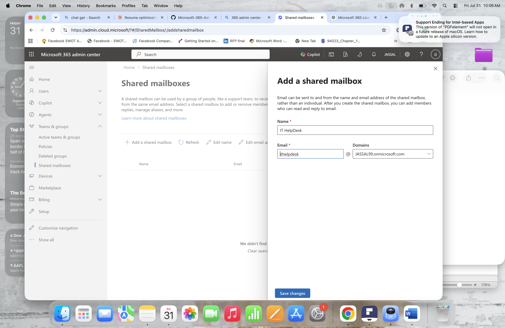
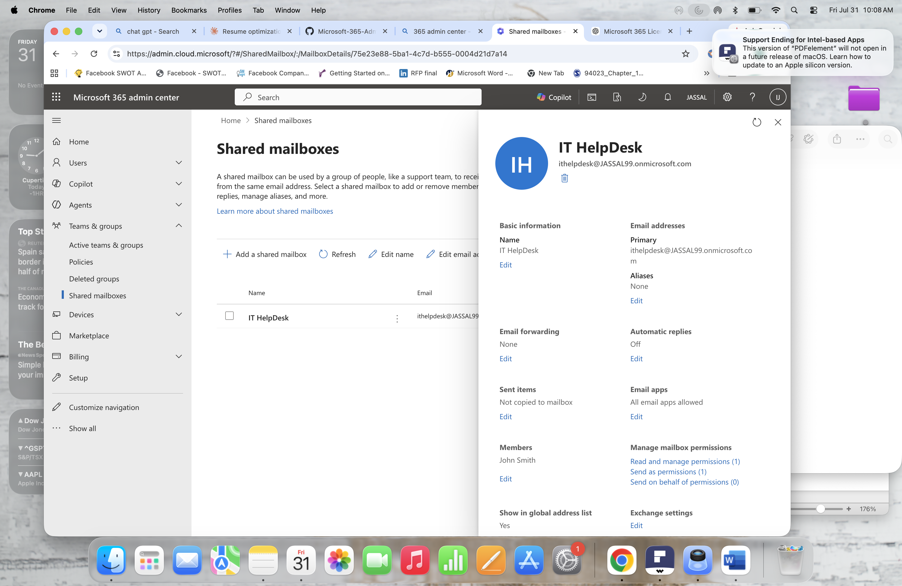
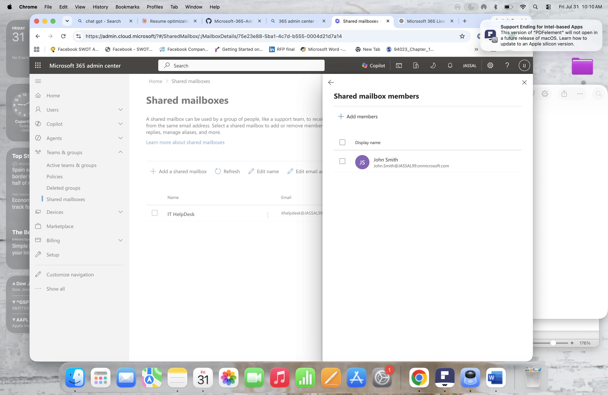
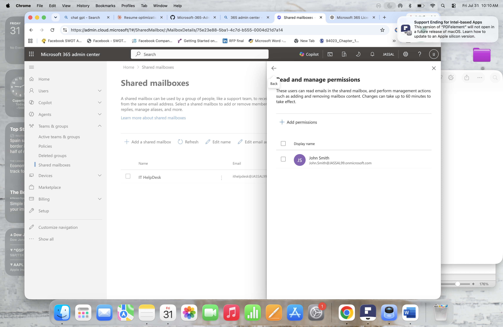

 Lab 3 – Exchange Online Shared Mailbox Administration

## Overview

In this lab, I configured and managed a Shared Mailbox in Exchange Online using the Microsoft 365 Admin Center.

The purpose of this lab was to demonstrate how Microsoft 365 Administrators create shared mailboxes and configure delegated access permissions for users.

---

# Objective

The objectives of this lab were:

- Create an Exchange Online Shared Mailbox
- Add users to the shared mailbox
- Configure mailbox permissions
- Understand Full Access and Send As permissions
- Verify shared mailbox configuration

---

# Scenario

The IT department requires a shared mailbox for handling support requests.

As the Microsoft 365 Administrator, I created an IT Helpdesk shared mailbox and provided access to authorized users.

---

# Shared Mailbox Configuration

**Mailbox Name:**

IT Helpdesk

**Purpose:**

Provide a centralized mailbox for IT support communication.

**Members:**

- IRBANJEET JASSAL
- John Smith

---

# Permissions Configured

## Full Access

Assigned Full Access permission to John Smith.

Full Access allows the user to:

- Open the shared mailbox
- Read emails
- Manage mailbox folders
- Organize messages

---

## Send As

Assigned Send As permission to John Smith.

Send As allows the user to send emails that appear to come directly from the shared mailbox.

Example:

From:
IT Helpdesk <ithelpdesk@company.com>

---

# Screenshots

## Shared Mailbox Creation

## Shared Mailbox Overview

## Shared Mailbox Members

## Full Access Permission

## Send As Permission

---

# Skills Demonstrated

- Exchange Online Administration
- Microsoft 365 Admin Center
- Shared Mailbox Management
- Delegated Permissions
- Full Access Permissions
- Send As Permissions
- Microsoft 365 Collaboration Services

---

# Lab Outcome

Successfully created and configured an Exchange Online Shared Mailbox, assigned delegated permissions, and demonstrated common Microsoft 365 Administrator mailbox management tasks.
