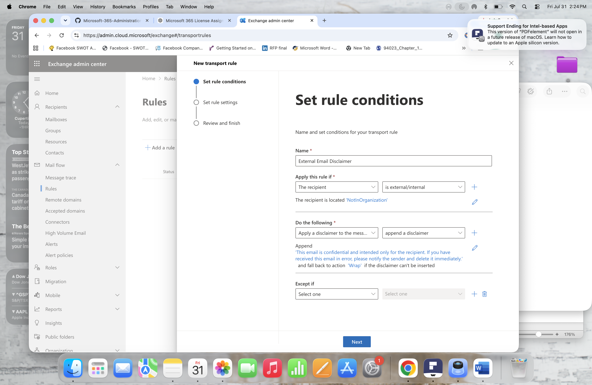
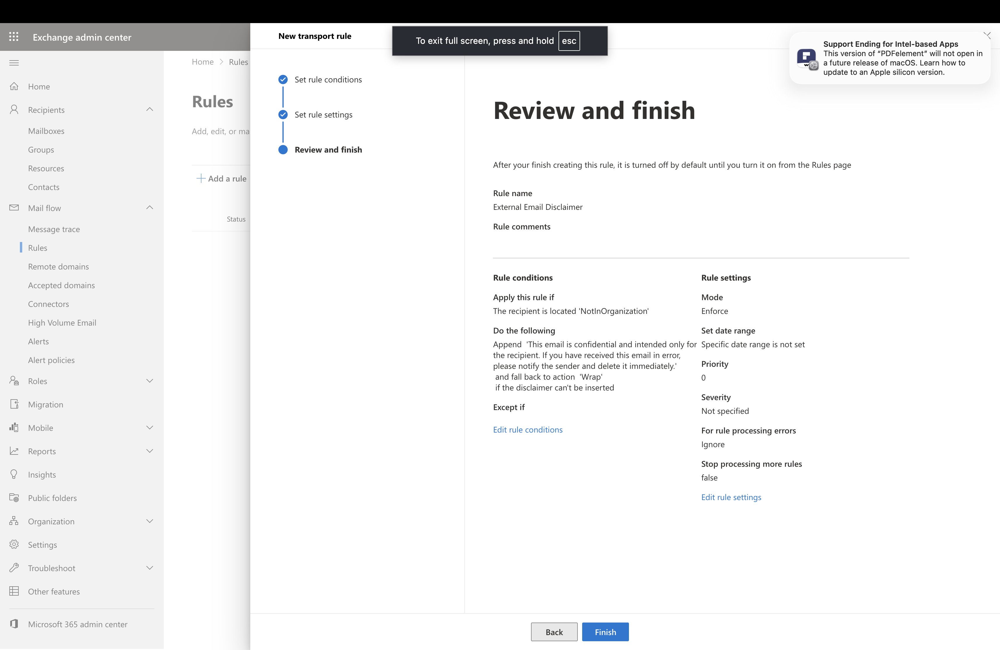
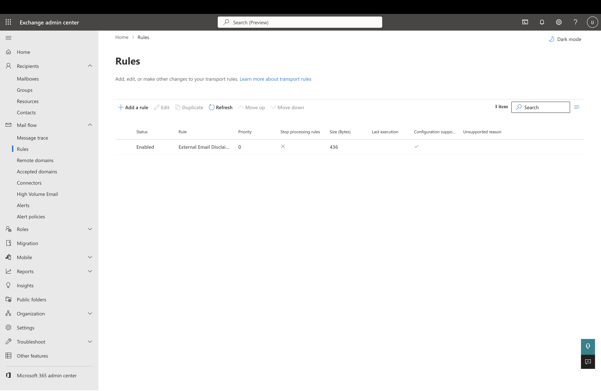

# Lab 4 – Exchange Online Mail Flow Rules

## Overview

In this lab, I configured and managed a Mail Flow Rule in Exchange Online using the Exchange Admin Center.

The lab demonstrates how Microsoft 365 Administrators use Exchange Online Mail Flow Rules (Transport Rules) to automatically process email messages based on defined conditions and organizational requirements.

---

# Objectives

The objectives of this lab were:

- Create an Exchange Online Mail Flow Rule
- Configure rule conditions and actions
- Apply an automatic email disclaimer
- Understand Exchange Online Transport Rules
- Verify the Mail Flow Rule configuration

---

# Scenario

The organization requires all emails sent outside the organization to include a confidentiality disclaimer.

As the Microsoft 365 Administrator, I created a Mail Flow Rule to automatically append a disclaimer to external email messages.

---

# Part 1 – Create Mail Flow Rule

## Rule Details

**Rule Name:**

External Email Disclaimer

**Purpose:**

Automatically append a confidentiality disclaimer to emails sent outside the organization.

---

# Mail Flow Rule Configuration

## Condition

The rule was configured to apply when:

- The recipient is located outside the organization

---

## Action

Configured the following action:

- Append a disclaimer to the message

**Disclaimer Text**

> This email is confidential and intended only for the recipient. If you have received this email in error, please notify the sender and delete it immediately.

---

## Fallback Action

Configured the following fallback action:

**Wrap**

The Wrap option ensures the disclaimer is still delivered if Exchange Online cannot modify the original email message.

---

# Mail Flow Rule Purpose

Exchange Online Mail Flow Rules are commonly used to:

- Add legal disclaimers
- Enforce email policies
- Improve email security
- Support organizational compliance
- Automate email processing

---

# Screenshots

## Mail Flow Rule Creation

Configured the Mail Flow Rule with the required conditions and actions.

---

## Mail Flow Rule Review and Create

Reviewed the complete rule configuration before creating the Mail Flow Rule.

---

## Mail Flow Rule Overview

Verified the newly created Mail Flow Rule in the Exchange Admin Center.

---

# Skills Demonstrated

- Exchange Online Administration
- Exchange Admin Center
- Mail Flow Rules
- Exchange Transport Rules
- Email Policy Management
- Microsoft 365 Administration

---

# Lab Outcome

Successfully created and configured an Exchange Online Mail Flow Rule to automatically append a confidentiality disclaimer to emails sent outside the organization, demonstrating practical Exchange Online administration and email policy management.
