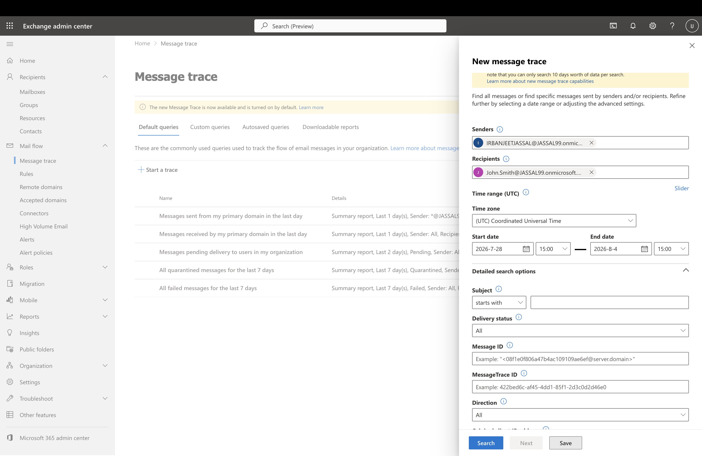
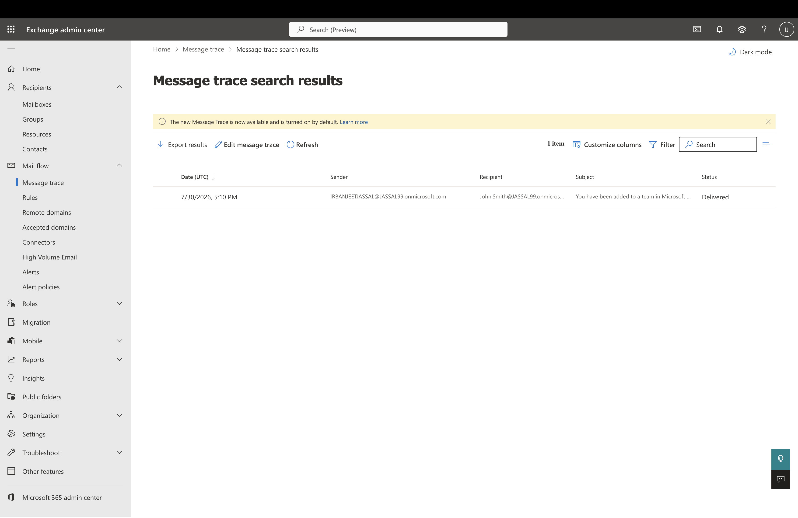
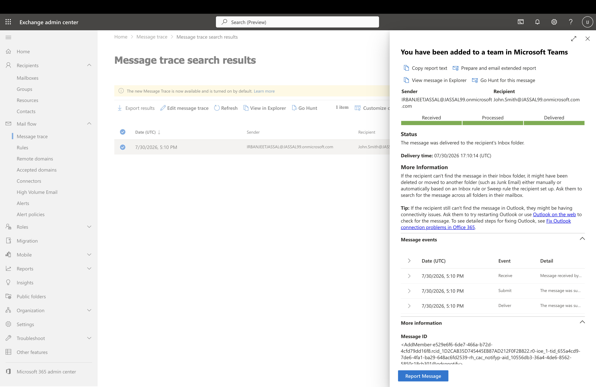

# Lab 5 – Exchange Online Message Trace

## Overview

In this lab, I used Message Trace in the Exchange Admin Center to track and verify email delivery within Exchange Online.

The lab demonstrates how Microsoft 365 Administrators troubleshoot email delivery issues by tracing messages, reviewing delivery status, and analyzing message events.

---

# Objectives

The objectives of this lab were:

- Perform a Message Trace in Exchange Online
- Search for email messages using sender and recipient information
- Review message delivery status
- Analyze message events and delivery details
- Understand how Message Trace is used for email troubleshooting

---

# Scenario

A user reported that an email might not have been received.

As the Microsoft 365 Administrator, the task was to perform a Message Trace to determine whether the email was successfully delivered and review the message processing events.

---

# Part 1 – Perform Message Trace

## Search Criteria

**Sender:**

IRBANJEET JASSAL

**Recipient:**

John Smith

**Time Range:**

Last 7 Days

---

# Message Trace Results

The Message Trace search returned the matching email message and displayed:

- Sender
- Recipient
- Subject
- Delivery Status
- Date and Time

The message status was successfully verified as **Delivered**.

---

# Message Details

The message details were reviewed to verify:

- Delivery status
- Delivery time
- Message processing events
- Sender and recipient information
- Message event history

Message Trace provides administrators with detailed visibility into how an email was processed within Exchange Online.

---

# Why Message Trace is Important

Microsoft 365 Administrators use Message Trace to:

- Troubleshoot email delivery issues
- Verify successful email delivery
- Investigate failed or delayed messages
- Review message processing events
- Assist users with Exchange Online email issues

---

# Screenshots

## Message Trace Search

Configured the Message Trace search using sender, recipient, and time range.

---

## Message Trace Results

Reviewed the Message Trace search results and verified the email delivery status.

---

## Message Trace Details

Reviewed the detailed message information, including delivery status, processing events, and message timeline.

---

# Skills Demonstrated

- Exchange Online Administration
- Exchange Admin Center
- Message Trace
- Email Troubleshooting
- Mail Flow Analysis
- Microsoft 365 Administration

---

# Lab Outcome

Successfully performed a Message Trace in Exchange Online to verify email delivery, review message processing events, and demonstrate practical troubleshooting skills using the Exchange Admin Center.
