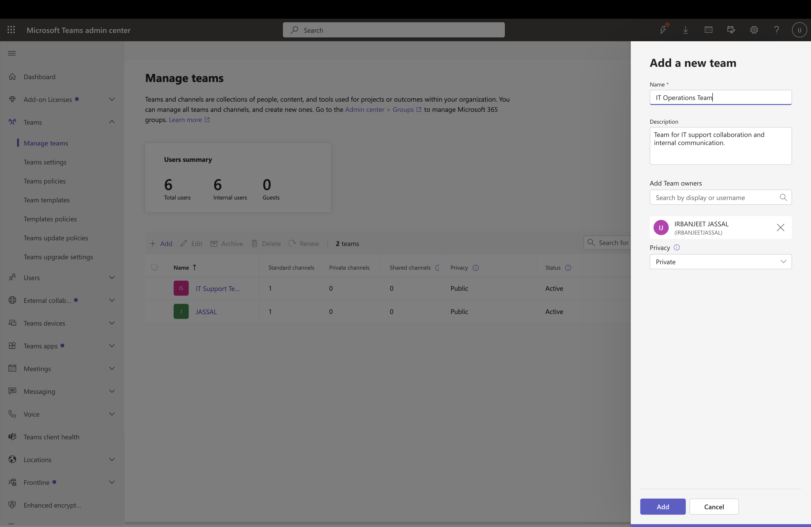
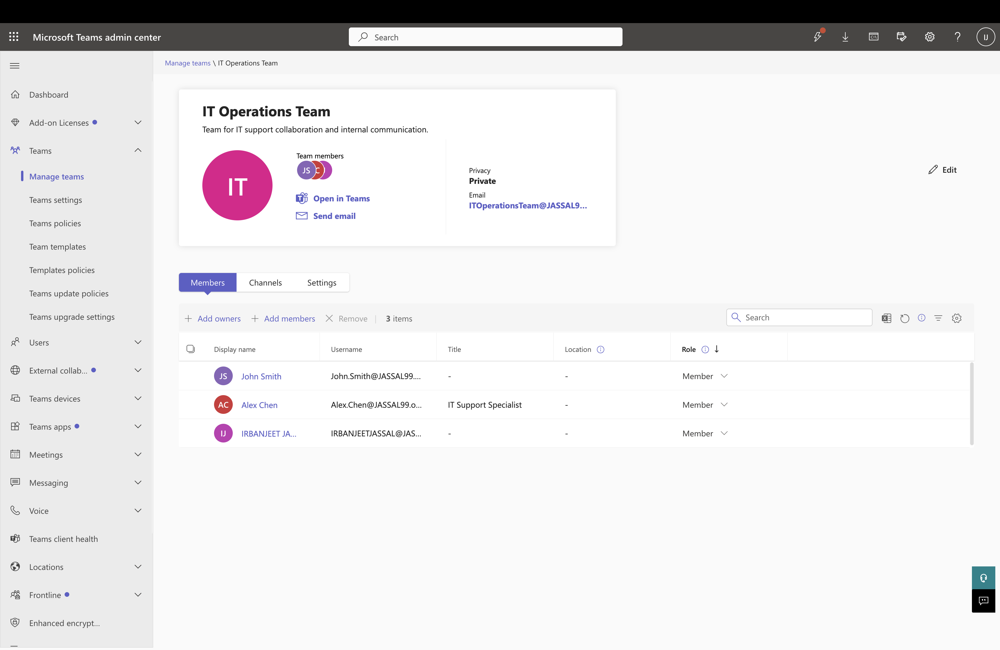
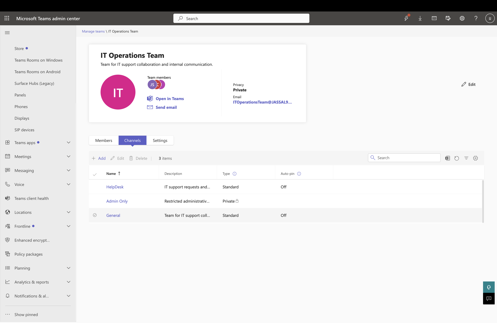
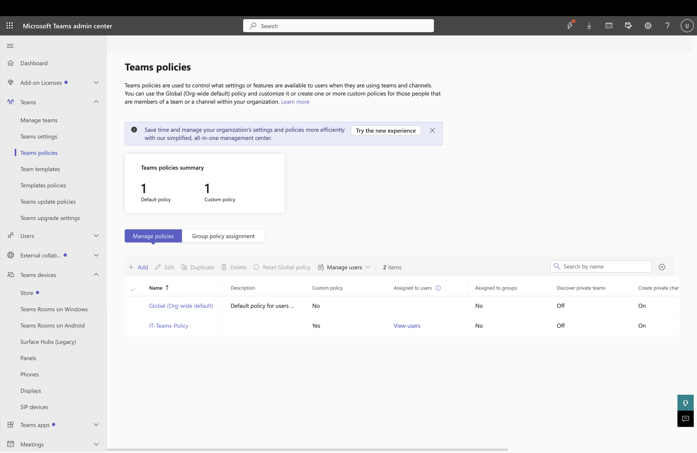
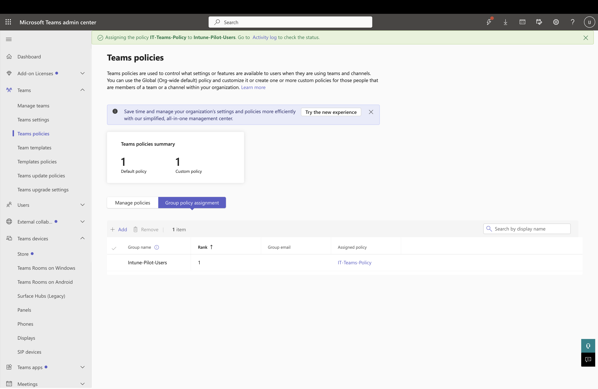

# Lab 6 – Microsoft Teams Administration

## Overview

In this lab, I configured and managed Microsoft Teams resources using the Microsoft Teams Admin Center and Microsoft Teams. The lab demonstrates essential Microsoft 365 administration tasks, including creating a Team, managing membership, creating collaboration channels, and configuring Teams policies.

---

# Objectives

The objectives of this lab were:

- Create a Microsoft Team
- Configure Team settings
- Add and manage Team members
- Create collaboration channels
- Review and manage Teams policies
- Configure group-based policy assignment
- Understand Microsoft Teams administration

---

# Scenario

The IT department required a dedicated Microsoft Teams workspace for internal collaboration and communication.

As the Microsoft 365 Administrator, the task was to create and configure a Microsoft Team, manage team membership, organize communication through channels, and configure Teams policies using the Microsoft Teams Admin Center.

---

# Part 1 – Create a Microsoft Team

A new Microsoft Team was created for the IT department.

The following settings were configured:

- Team Name
- Description
- Privacy Type
- Team Owner

This provides a secure collaboration workspace for department members.

---

# Part 2 – Manage Team Membership

Team membership was configured by assigning users appropriate roles.

The following tasks were completed:

- Added Team members
- Verified Team owner
- Reviewed membership assignments

Proper membership management ensures users have the correct level of access to collaborate within Microsoft Teams.

---

# Part 3 – Create Team Channels

Channels were created to organize communication within the Team.

The configured channels provide dedicated spaces for different discussions while improving collaboration and information organization.

---

# Part 4 – Teams Policy Management

The Teams Policies section in the Microsoft Teams Admin Center was reviewed.

A custom Teams policy was created to demonstrate policy management and governance within Microsoft Teams.

---

# Part 5 – Group Policy Assignment

A Teams policy was assigned using Group Policy Assignment.

This demonstrates how administrators can apply Teams policies to Microsoft Entra groups, allowing policy settings to be managed centrally and automatically applied to group members.

---

# Why Microsoft Teams Administration is Important

Microsoft Teams Administrators use these features to:

- Manage collaboration workspaces
- Configure Team membership
- Organize communication through channels
- Apply governance and security policies
- Standardize Teams settings across departments
- Improve collaboration within Microsoft 365

---

# Screenshots

## Team Creation

Created a new Microsoft Team with the required configuration.

---

## Team Members

Configured Team membership and verified assigned members and owners.

---

## Team Channels

Created collaboration channels within the Team.

---

## Teams Policies

Created and reviewed Microsoft Teams policies.

---

## Group Policy Assignment

Assigned a Teams policy to a Microsoft Entra group using Group Policy Assignment.

---

# Skills Demonstrated

- Microsoft Teams Administration
- Microsoft Teams Admin Center
- Team Creation and Configuration
- Team Membership Management
- Channel Management
- Teams Policy Management
- Group Policy Assignment
- Microsoft 365 Administration

---

# Lab Outcome

Successfully configured and managed Microsoft Teams resources by creating a Team, managing membership, organizing collaboration through channels, creating Teams policies, and assigning policies using Group Policy Assignment. This lab demonstrates practical Microsoft Teams administration skills commonly performed by Microsoft 365 Administrators.
