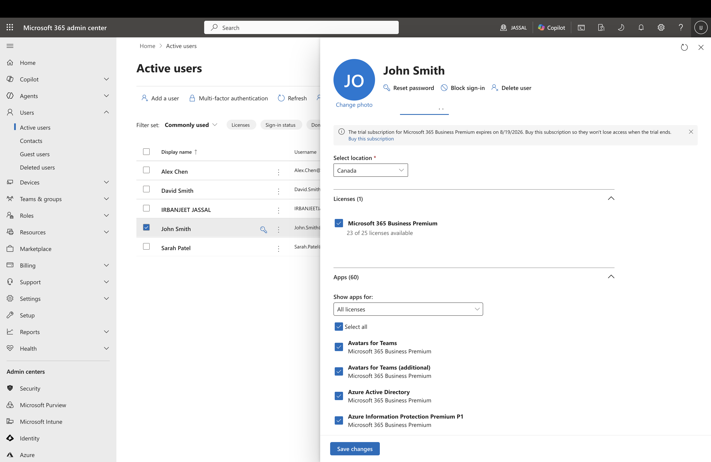
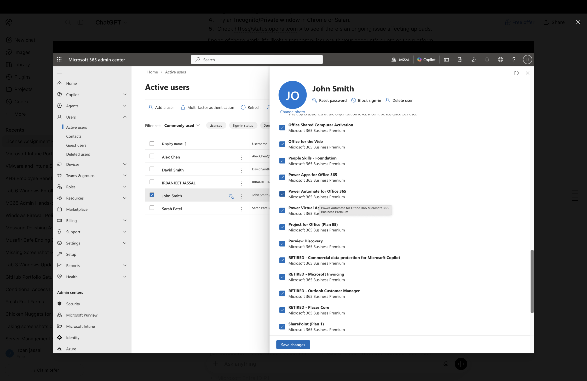

# Lab 1 – Microsoft 365 License Management

## Objective

Assign a Microsoft 365 Business Premium license to a user and verify the services included with the license using the Microsoft 365 Admin Center.

---

## Scenario

A new employee, **John Smith**, requires access to Microsoft 365 services. As the Microsoft 365 Administrator, the task is to assign the appropriate Microsoft 365 Business Premium license and verify that the required cloud services are available.

---

## Tasks Performed

- Selected the user account (John Smith).
- Assigned a Microsoft 365 Business Premium license.
- Verified the license assignment was successful.
- Reviewed the Microsoft 365 service plans included with the license.
- Confirmed that productivity, collaboration, security, and device management services were enabled.

---

## Skills Demonstrated

- Microsoft 365 Administration
- User Management
- License Management
- Microsoft 365 Business Premium
- Microsoft 365 Admin Center
- Service Plan Verification

---

## Screenshots

### 1. License Assignment

Assigned a Microsoft 365 Business Premium license to the user.

---

### 2. Service Plans (Part 1)

Reviewed the Microsoft 365 services included with the assigned license.

---

### 3. Service Plans (Part 2)

Verified additional Microsoft 365 services available through the assigned license.

---

## Outcome

Successfully assigned a Microsoft 365 Business Premium license to a user account, verified the license status, and reviewed the available Microsoft 365 service plans to ensure the user has access to the required cloud services.
