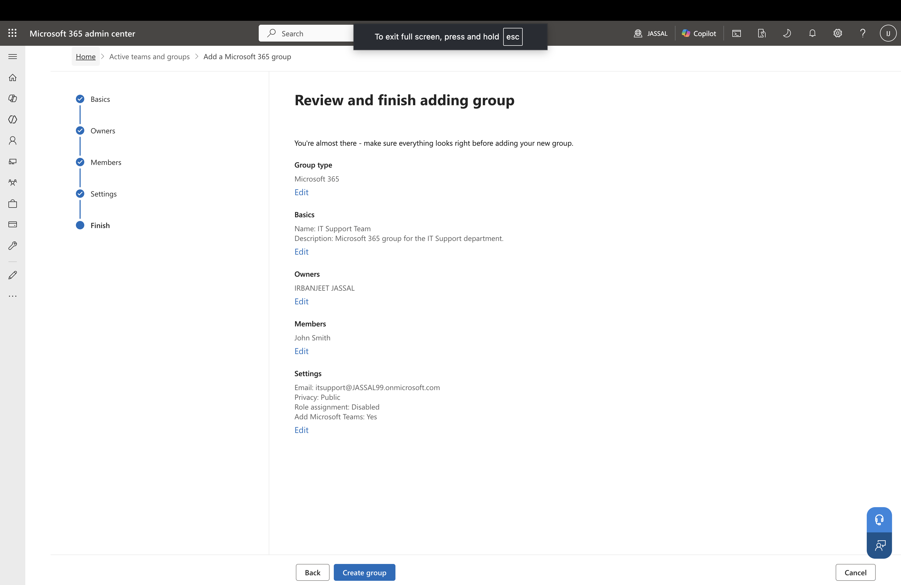
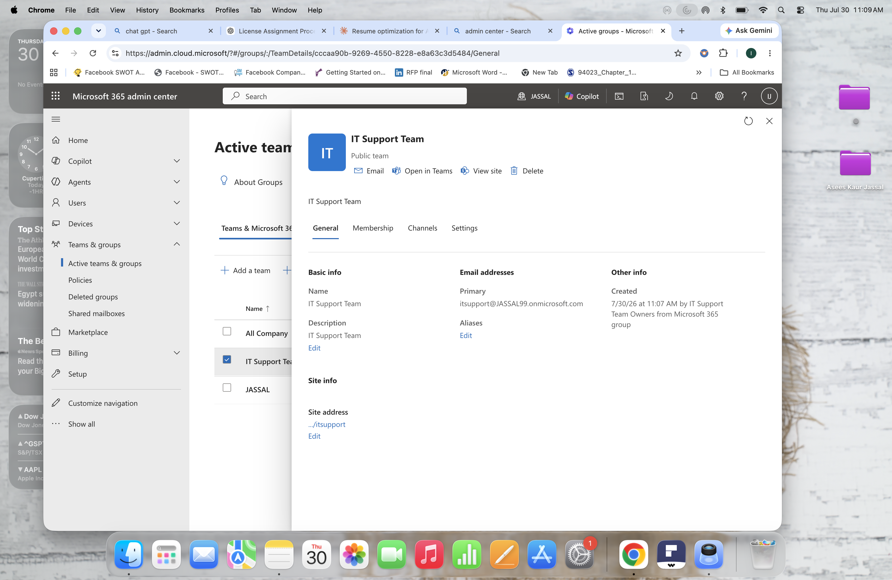
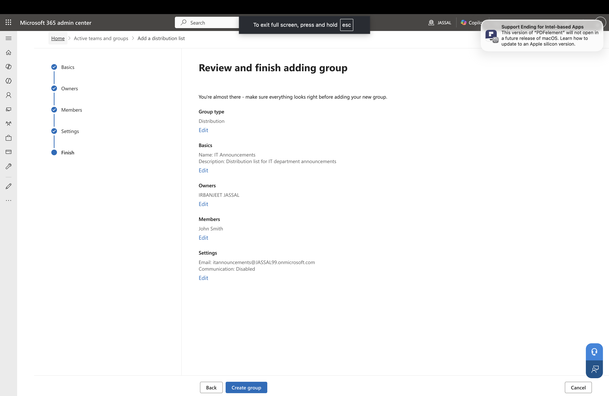
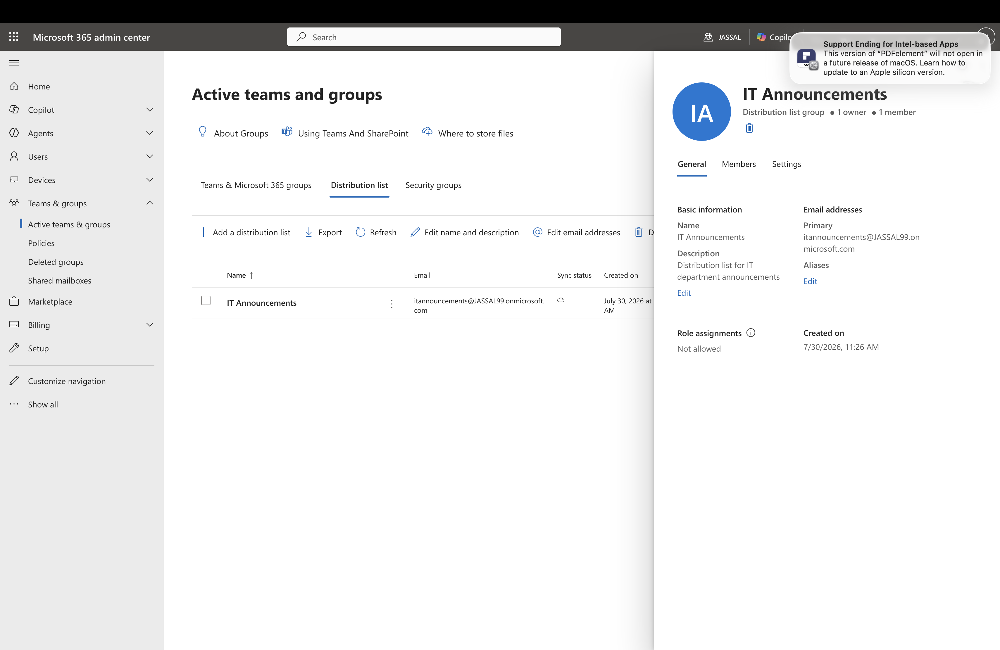

# Lab 2 – Microsoft 365 Groups & Distribution Lists

## Overview

In this lab, I configured and managed Microsoft 365 collaboration and email communication objects using the Microsoft 365 Admin Center.

The lab demonstrates the creation of:

- Microsoft 365 Group with Microsoft Teams integration
- Distribution List for email communication

These are commonly used by Microsoft 365 Administrators to provide collaboration and communication solutions within organizations.

---

# Objectives

The objectives of this lab were:

- Create and configure a Microsoft 365 Group
- Enable Microsoft Teams integration
- Manage group owners and members
- Understand Microsoft 365 Group resources
- Create and configure a Distribution List
- Understand the difference between collaboration groups and email distribution groups

---

# Part 1 – Create Microsoft 365 Group

## Group Details

**Group Name:**
IT Support Team

**Purpose:**
Created a collaboration workspace for the IT department.

**Members:**
- IRBANJEET JASSAL (Owner)
- John Smith (Member)

**Microsoft Teams Integration:**
Enabled

---

# Microsoft 365 Group Resources

Members receive access to:

- Microsoft Teams workspace
- SharePoint team site
- Shared files
- Group conversations
- Shared calendar

---

# Microsoft Teams Integration

The Microsoft 365 Group was connected with Microsoft Teams.

Members can collaborate through:

- Teams channels
- Posts
- Meetings
- Shared files

Files uploaded through Teams are stored in the connected SharePoint document library.

---

# Part 2 – Create Distribution List

## Distribution List Details

**Name:**
IT Announcements

**Purpose:**
Created an email distribution group for sending announcements to IT department members.

**Members:**
- John Smith

---

# Distribution List Purpose

A Distribution List allows administrators to send one email to multiple recipients using a single email address.

Example:

Email sent to:

itannouncements@company.com

Delivered to:

John Smith
Other group members

Unlike Microsoft 365 Groups, Distribution Lists do not provide:

- Microsoft Teams
- SharePoint sites
- Shared files
- Collaboration workspace

They are designed mainly for email communication.

---

# Screenshots

## Microsoft 365 Group Creation

## Microsoft 365 Group Overview

## Distribution List Creation

## Distribution List Overview

---

# Skills Demonstrated

- Microsoft 365 Admin Center
- Microsoft 365 Group Management
- Distribution List Management
- Microsoft Teams Integration
- SharePoint Integration
- Exchange Online Collaboration Objects
- User Membership Management

---

# Lab Outcome

Successfully created and configured Microsoft 365 collaboration and communication objects, 
